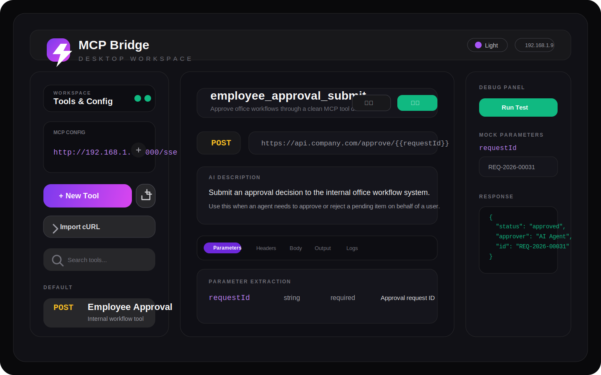
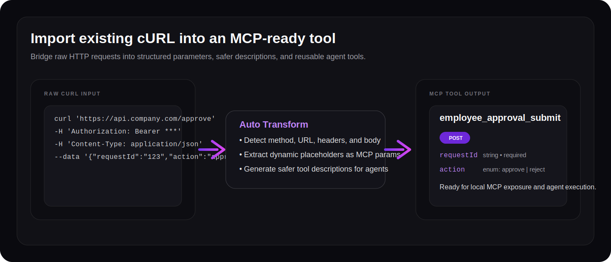
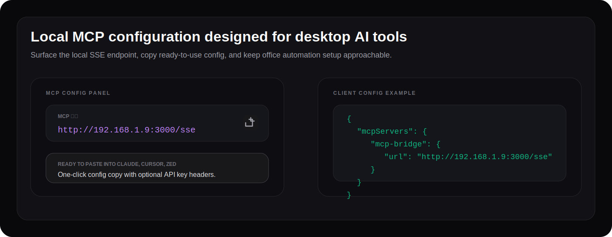

<p align="center">
  
</p>

<h1 align="center">MCP Bridge</h1>

<p align="center"><strong>将内部 API 和 cURL 工作流转换为可供 AI Agent 调用的本地 MCP 工具。</strong></p>

<p align="center">
  MCP Bridge 帮助团队把已有 HTTP 操作封装成结构化、本地优先、对 Agent 更友好的 MCP 工具，方便 Claude Desktop、Cursor、Zed 等客户端直接调用。
</p>

<p align="center">
  <a href="./README.md">English</a> ·
  <a href="./README.zh-CN.md">简体中文</a>
</p>

<p align="center">
  <a href="https://github.com/ainativeera/mcp-bridge/actions/workflows/ci.yml"></a>
  <a href="https://github.com/ainativeera/mcp-bridge/blob/main/LICENSE"></a>
  <a href="https://github.com/ainativeera/mcp-bridge/stargazers"></a>
  <a href="https://github.com/ainativeera/mcp-bridge/issues"></a>
</p>

<p align="center">
  <a href="https://github.com/ainativeera/mcp-bridge">GitHub</a> ·
  <a href="#快速开始">快速开始</a> ·
  <a href="#mcp-客户端配置示例">MCP 配置</a> ·
  <a href="./CONTRIBUTING.md">贡献指南</a> ·
  <a href="./SECURITY.md">安全说明</a>
</p>



MCP Bridge 特别适合真实办公自动化场景: 用户往往已经有可用的 cURL 命令，现在只需要把它们变成更安全、可复用、对 Agent 更友好的工具。

## 为什么选择 MCP Bridge

- 直接导入已有 cURL，而不是从零重建集成
- 为 Agent 定义清晰的参数 schema 和返回值说明
- 提供本地 MCP SSE 服务，方便桌面 AI 客户端接入
- 在工具真正交给 Agent 前先测试、调试和迭代
- 可打包为桌面应用，方便非技术用户使用

## 核心能力

- cURL 导入: 将常见请求自动解析为可编辑的 MCP 工具
- 工具编辑器: 配置 method、URL、headers、body、参数和输出字段
- 响应裁剪: 从大体积 JSON 中提取真正有价值的返回内容
- 本地持久化: 使用 SQLite 保存工具和调用日志
- MCP 传输层: 通过本地 SSE endpoint 暴露工具
- 桌面打包: 支持打包为 macOS 和 Windows 桌面应用

## 典型场景

- 将内部审批、CRM、ERP 接口变成 Agent 可调用工具
- 把重复性办公流程封装成稳定的 MCP 动作
- 基于已有 API 快速验证 AI Agent 工作流
- 给 AI 助手提供结构化、可控的业务操作能力

## 截图

### cURL 转 MCP 工作流



### 本地 MCP 配置面板



## 架构

```text
React UI
  -> Electron desktop shell
  -> Local Express server
  -> SQLite storage
  -> MCP SSE endpoint
  -> External APIs imported from cURL definitions
```

关键入口文件:

- `src/App.tsx`: 主界面
- `server.ts`: 本地 Express 服务和 MCP SSE 实现
- `electron-main.ts`: Electron 主进程与桌面桥接逻辑
- `src/db.ts`: SQLite 持久化层

## 快速开始

### 环境要求

- Node.js 20 或更高版本
- 推荐 npm 10 或更高版本
- macOS 用于 mac 桌面打包
- Windows 用于原生 Windows 验证，或者 macOS 配合 Electron Builder 做交叉打包

### 安装依赖

```bash
npm install
```

### 启动 Web 版本

```bash
npm run dev
```

浏览器访问:

```text
http://localhost:3000
```

### 启动桌面开发模式

```bash
npm run electron:dev
```

### 构建

```bash
npm run build
```

### 生成桌面安装包

```bash
npm run dist:mac
npm run dist:win
```

### 质量检查

```bash
npm run check
```

## 环境变量

复制 `.env.example` 为 `.env` 后按需修改。

重点变量包括:

- `PORT`: 本地 HTTP 与 SSE 端口
- `NODE_ENV`: development 或 production
- `DB_PATH`: SQLite 数据库位置
- `API_KEY`: 可选，用于保护本地 MCP 访问
- `RATE_LIMIT_WINDOW_MS`: 限流时间窗口
- `RATE_LIMIT_MAX_REQUESTS`: 窗口期内最大请求数
- `CORS_ORIGINS`: 逗号分隔的允许来源
- `LOG_LEVEL`: 日志级别

## MCP Endpoint

当本地服务运行时，SSE 地址为:

```text
http://localhost:3000/sse
```

在桌面应用中，UI 会优先展示检测到的本机局域网地址，方便其他设备上的 MCP 客户端接入。

## MCP 客户端配置示例

```json
{
  "mcpServers": {
    "mcp-bridge": {
      "url": "http://localhost:3000/sse"
    }
  }
}
```

如果启用了 API Key:

```json
{
  "mcpServers": {
    "mcp-bridge": {
      "url": "http://localhost:3000/sse",
      "headers": {
        "X-API-Key": "your-secret-api-key"
      }
    }
  }
}
```

## Roadmap

- 为高风险写操作增加更安全的确认机制
- 增强 API Key、Cookie、OAuth 风格鉴权模板
- 提升 cURL 解析覆盖率和稳定性
- 增加工具发布与风险分级流程
- 更完善的审计日志、回放和可观测性
- 提供更可复用的办公 SaaS 连接器模板

## 贡献

欢迎贡献。建议先阅读:

- [CONTRIBUTING.md](./CONTRIBUTING.md)
- [CODE_OF_CONDUCT.md](./CODE_OF_CONDUCT.md)
- [SECURITY.md](./SECURITY.md)

## 社区约定

- 保持尊重和建设性
- 尽量提交小而清晰的 PR
- 报 bug 时提供可复现步骤
- 提交新特性时兼顾办公自动化与 Agent 安全性

## 许可证

本项目基于 MIT License 开源，详见 [LICENSE](./LICENSE)。
